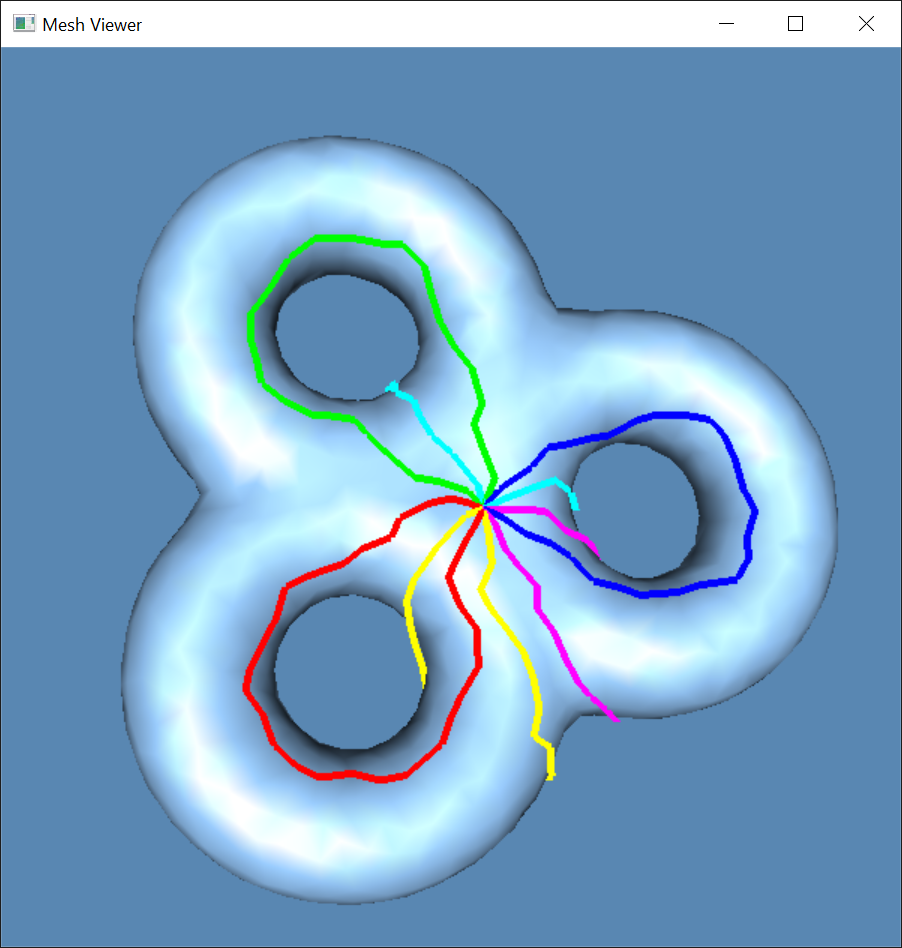
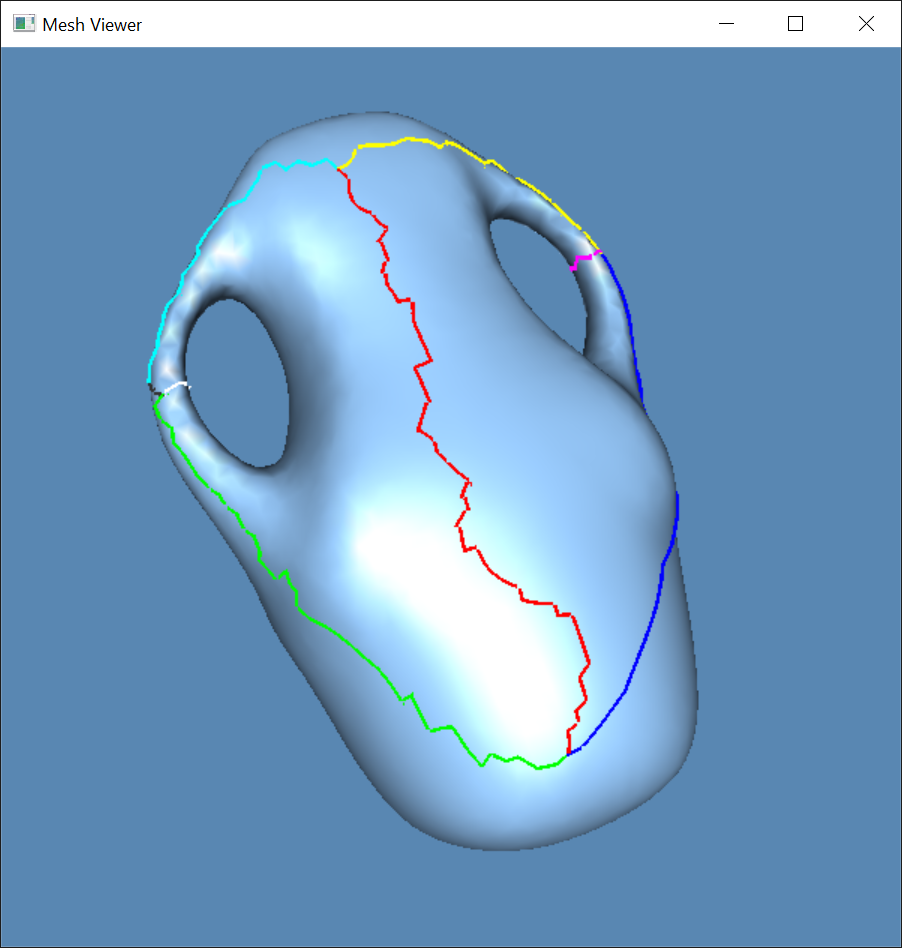
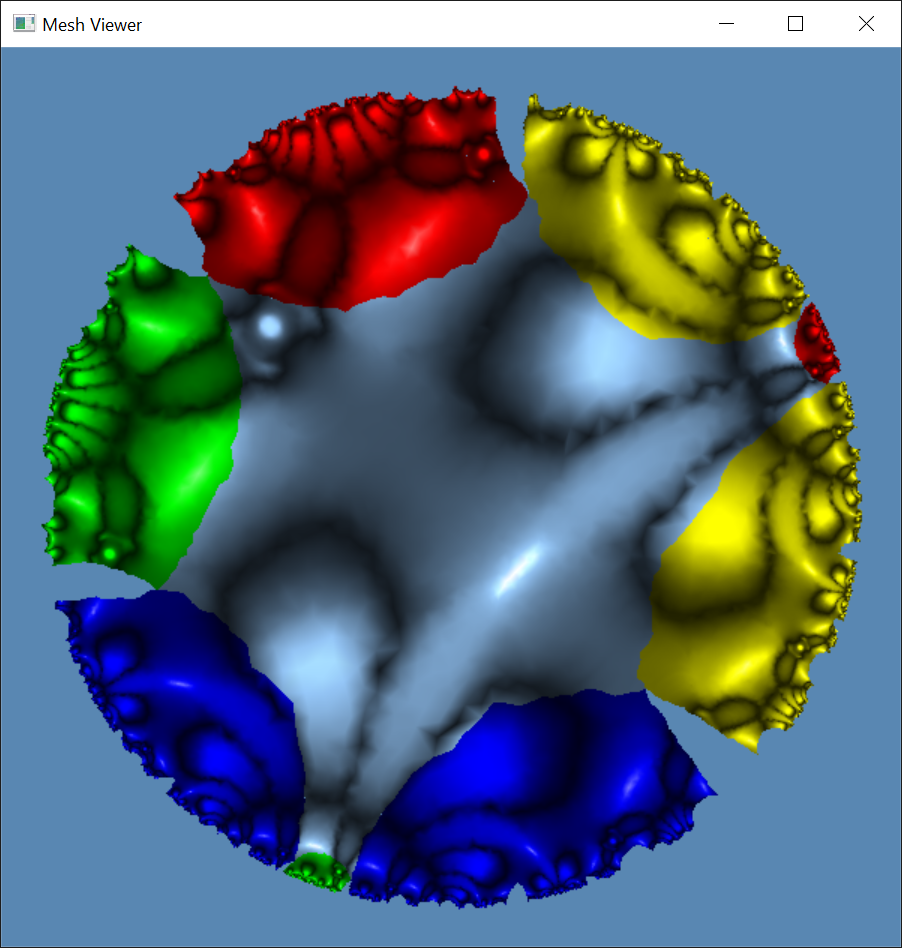
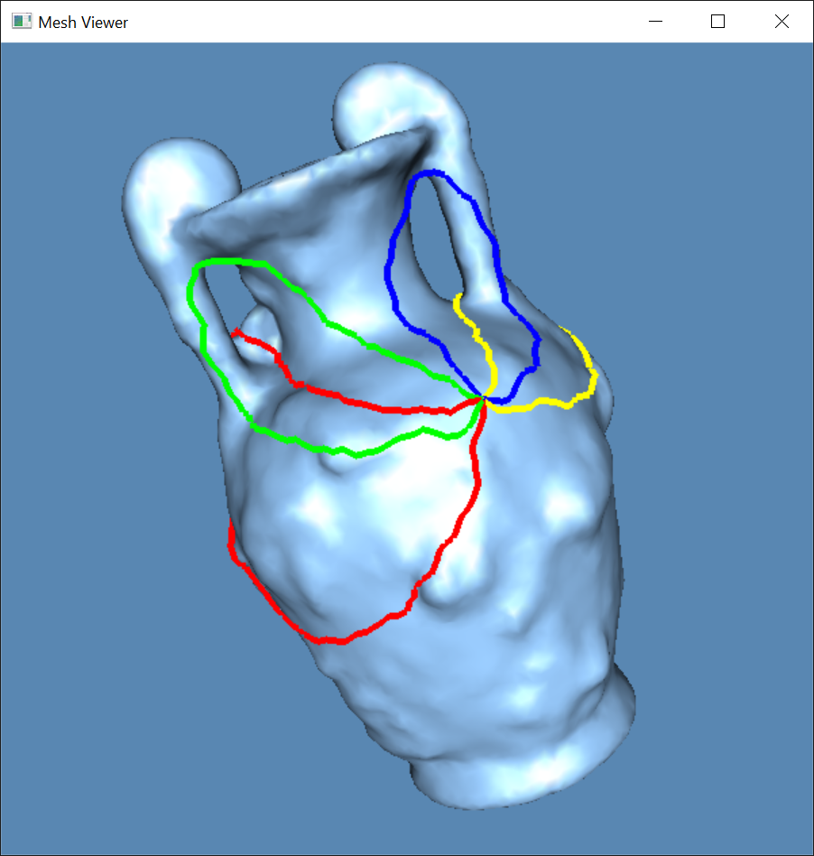
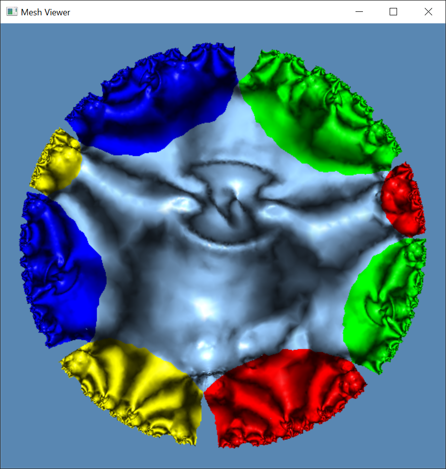

# Computational Conformal Geometry 2020 Final Project

This C++ project framework is to implement hyperbolic Ricci flow algorithm.

## System

The code has been tested on Windows 10, Ubuntu 18.04 and MacOS 10.15.5, if there is any problem, please let me know.

## Directory Structure

``` txt
hyperbolic               -- Folder for computing hyperbolic mapping. 
data                     -- Some models.
CMakeLists.txt           -- CMake configuration file.
resources                -- Some resources needed.
3rdparty                 -- MeshLib and freeglut libraries.
```

## Configuration

Follow the instruction in the README.md of each algorithm folder.

## Results

| Original surface | Universal covering space |
| ---------------- | ------------------------ |
|   |   |
|   |   |
|     |     |
|  |  |
